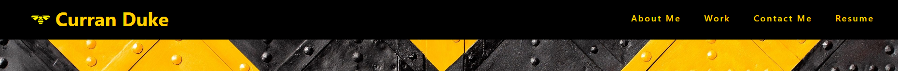
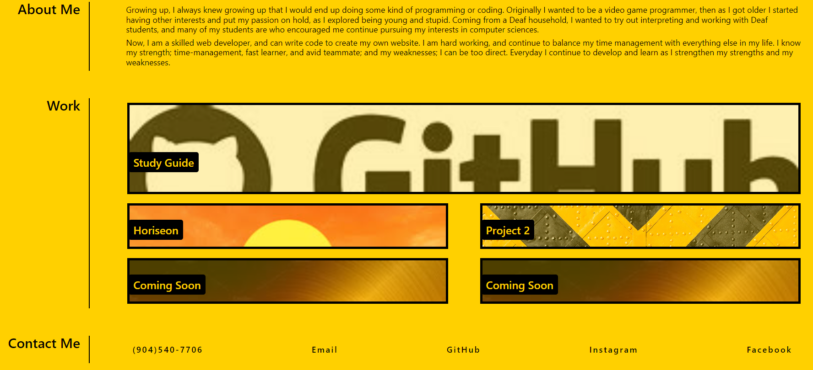

# Module 2 Challenge

## Description

This is my portfolio, created in order to show for all my progress throughout my course and my career. In this webpage application, you will be able to see any and all my projects within it, along with a small introduction as to who i am as a person. You will also be able to contact me through this page as well. 

## Table of Contents

- Installation
- Usage
- [Credits]
- [License]

## Installation

In order to use this application, you will only need a basic web browser. Any will work, whether it be Microsoft Edge, Google Chrome, Mozilla Firefox, or even Internet Explorer.

## Usage
In order to use this website you will need to type in your browser "StyngerBee.github.io/Module-2-Challenge".

After that you can use the navigational bar at the top to skip to any part you would like to read, by clicking one of the four options.

Once you are where you want to be, you can either read the contents, or click on one of the buttons that allow you to view my other projects or even contact me.

## Credits

Mateo Wallace - https://github.com/Mateo-Wallace

## License

MIT License

Copyright (c) 2022 Curran Duke

Permission is hereby granted, free of charge, to any person obtaining a copy
of this software and associated documentation files (the "Software"), to deal
in the Software without restriction, including without limitation the rights
to use, copy, modify, merge, publish, distribute, sublicense, and/or sell
copies of the Software, and to permit persons to whom the Software is
furnished to do so, subject to the following conditions:

The above copyright notice and this permission notice shall be included in all
copies or substantial portions of the Software.

THE SOFTWARE IS PROVIDED "AS IS", WITHOUT WARRANTY OF ANY KIND, EXPRESS OR
IMPLIED, INCLUDING BUT NOT LIMITED TO THE WARRANTIES OF MERCHANTABILITY,
FITNESS FOR A PARTICULAR PURPOSE AND NONINFRINGEMENT. IN NO EVENT SHALL THE
AUTHORS OR COPYRIGHT HOLDERS BE LIABLE FOR ANY CLAIM, DAMAGES OR OTHER
LIABILITY, WHETHER IN AN ACTION OF CONTRACT, TORT OR OTHERWISE, ARISING FROM,
OUT OF OR IN CONNECTION WITH THE SOFTWARE OR THE USE OR OTHER DEALINGS IN THE
SOFTWARE.

---
